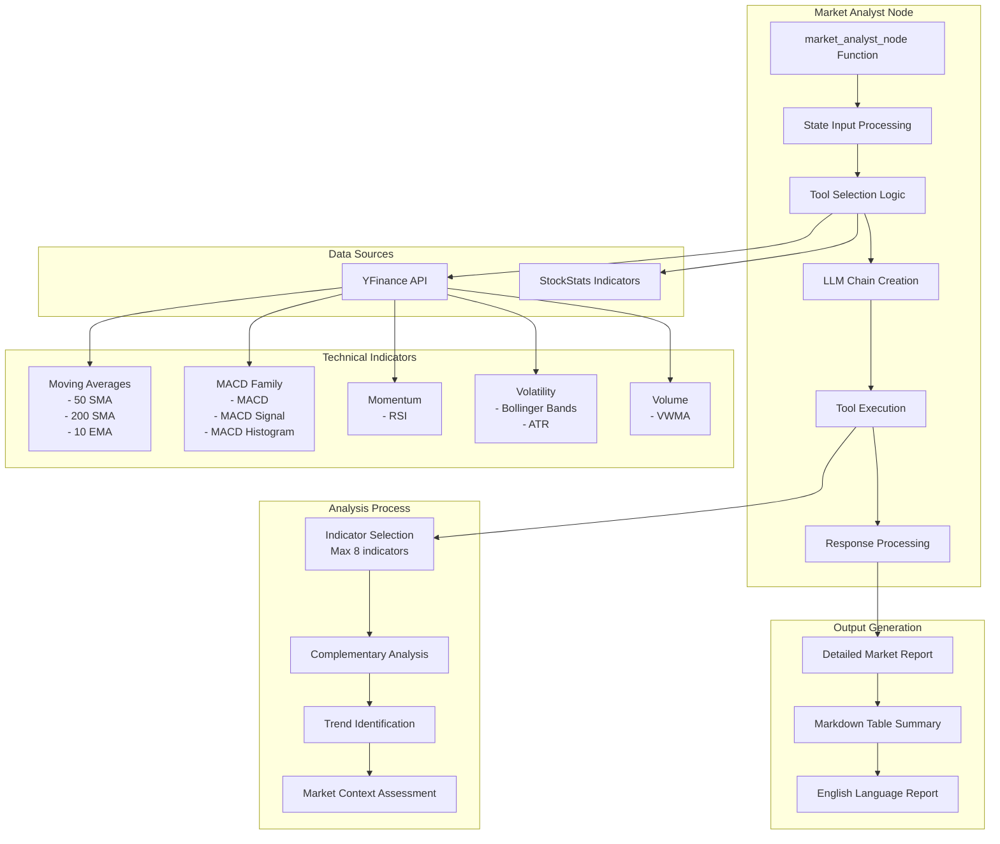
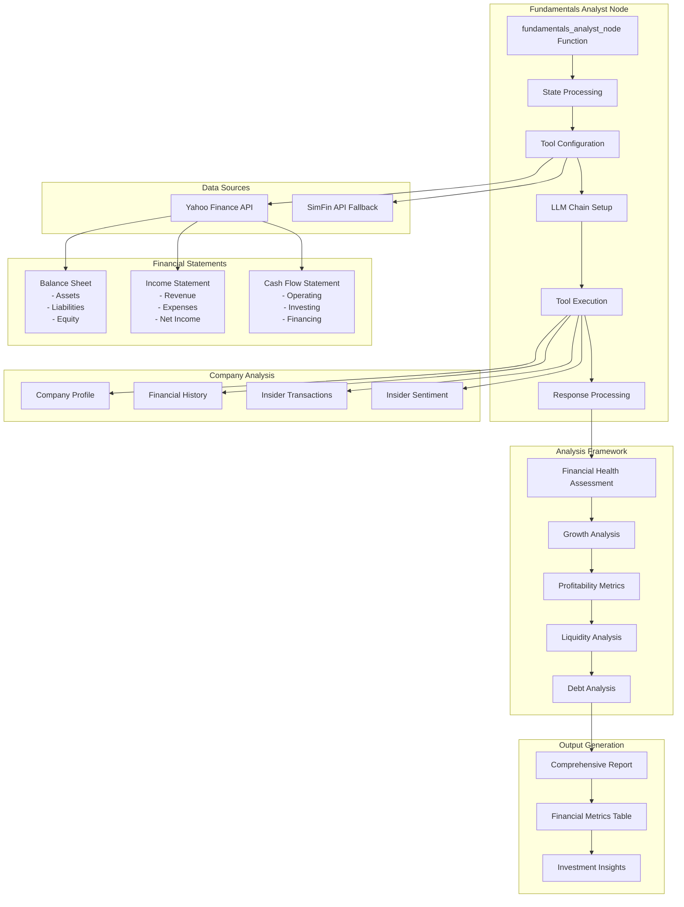
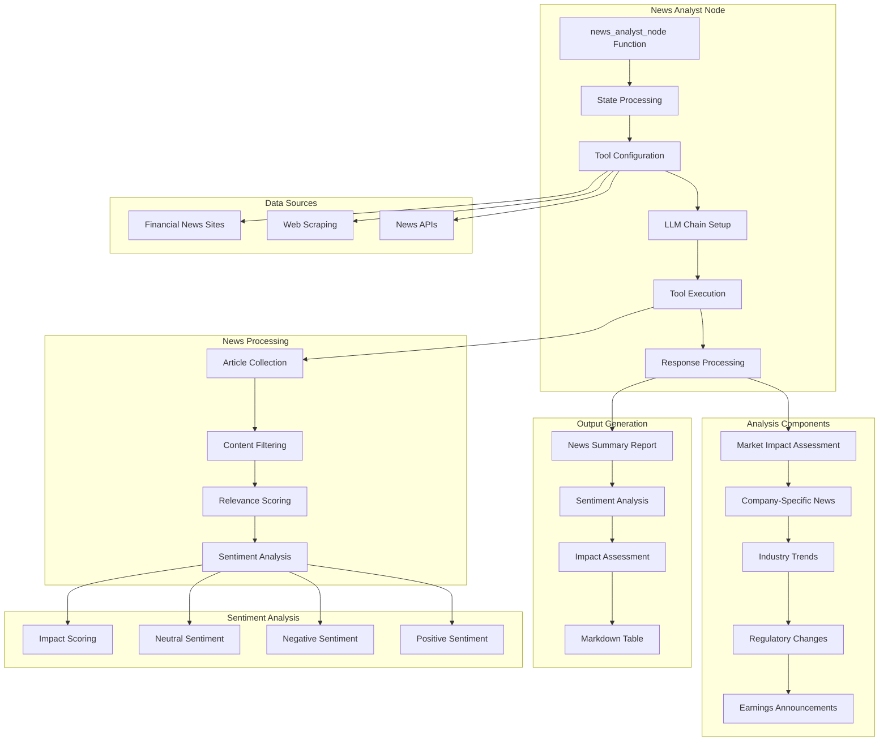
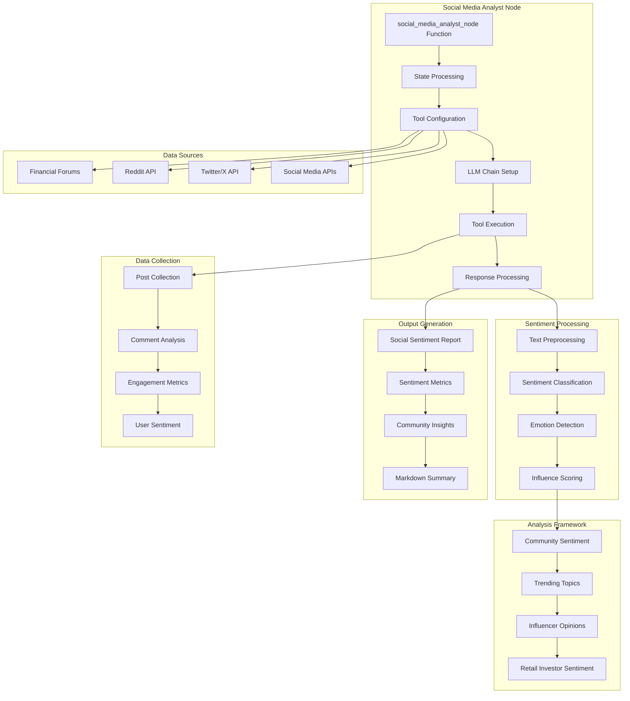
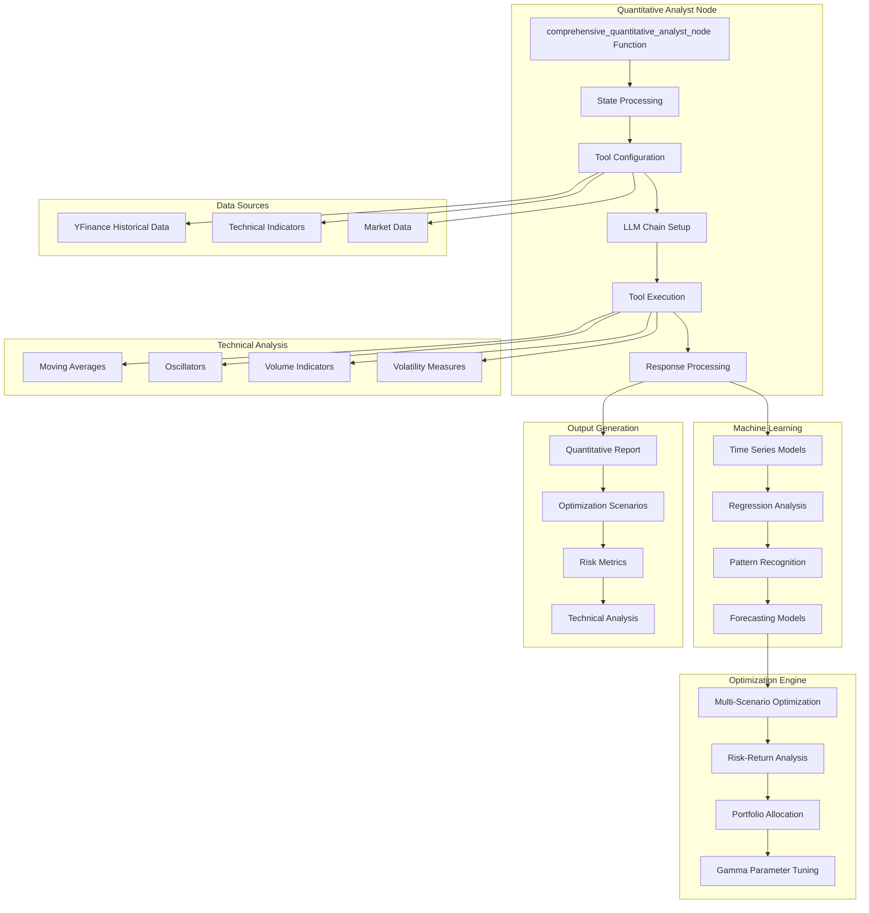
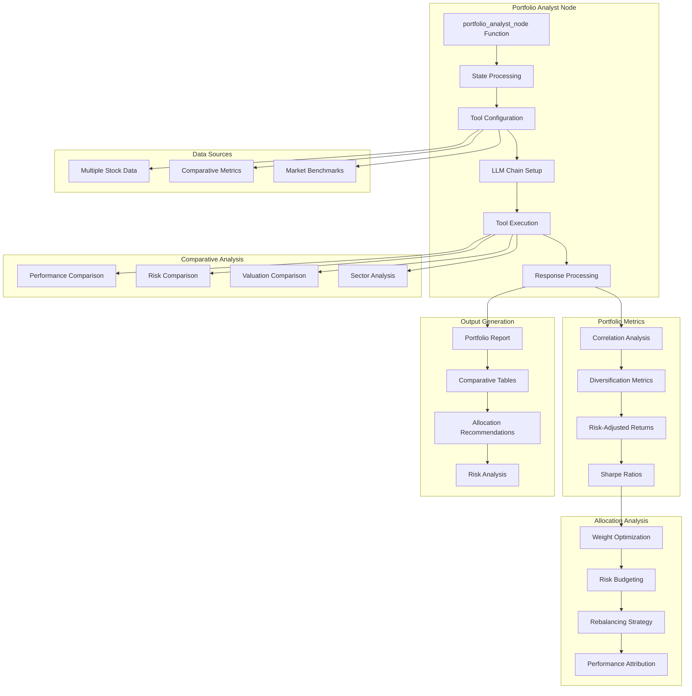
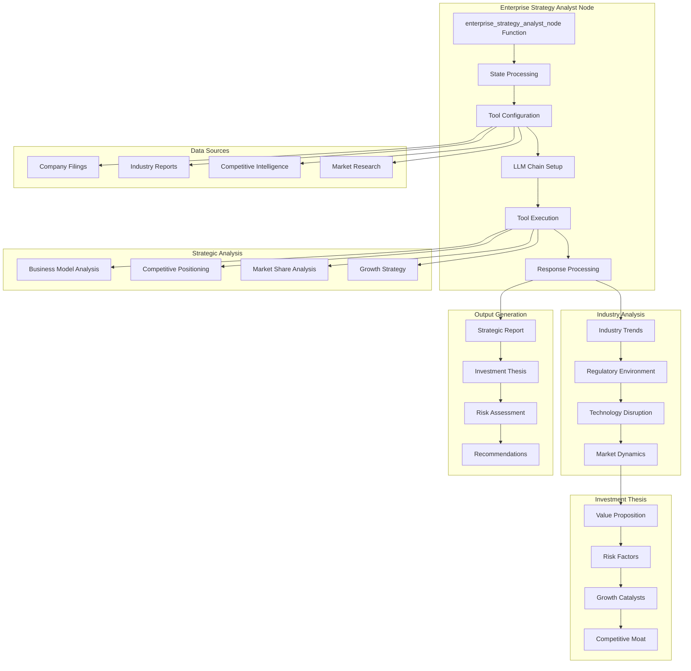
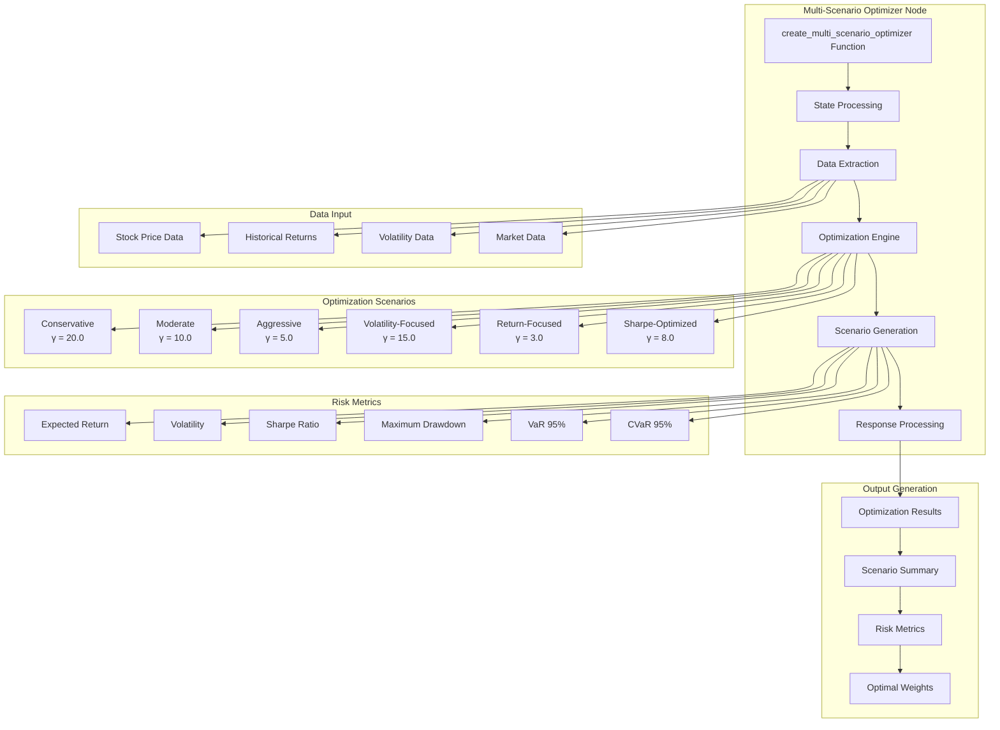

# TradingAgents Analyst Architecture Diagrams

## 1. Market Analyst Architecture

## 2. Fundamentals Analyst Architecture

## 3. News Analyst Architecture

## 4. Social Media Analyst Architecture

## 5. Quantitative Analyst Architecture

## 6. Portfolio Analyst Architecture

## 7. Enterprise Strategy Analyst Architecture

## 8. Multi-Scenario Optimizer Architecture

