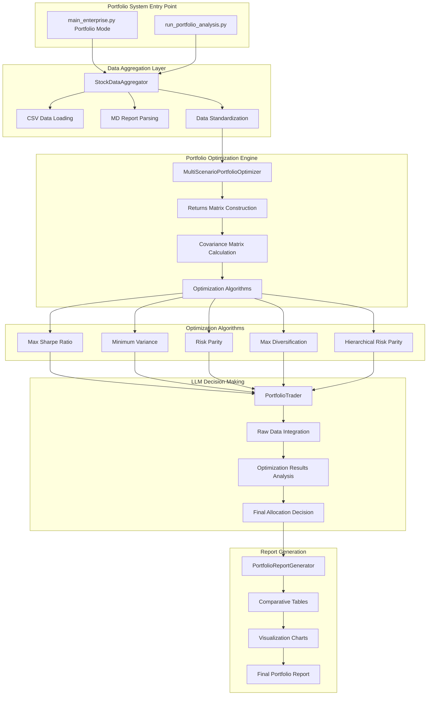
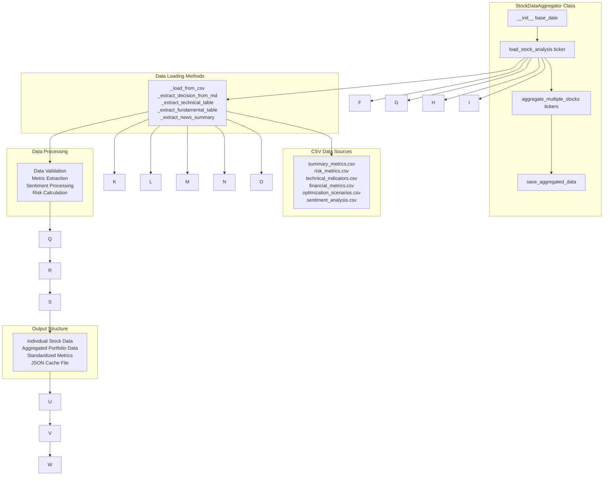
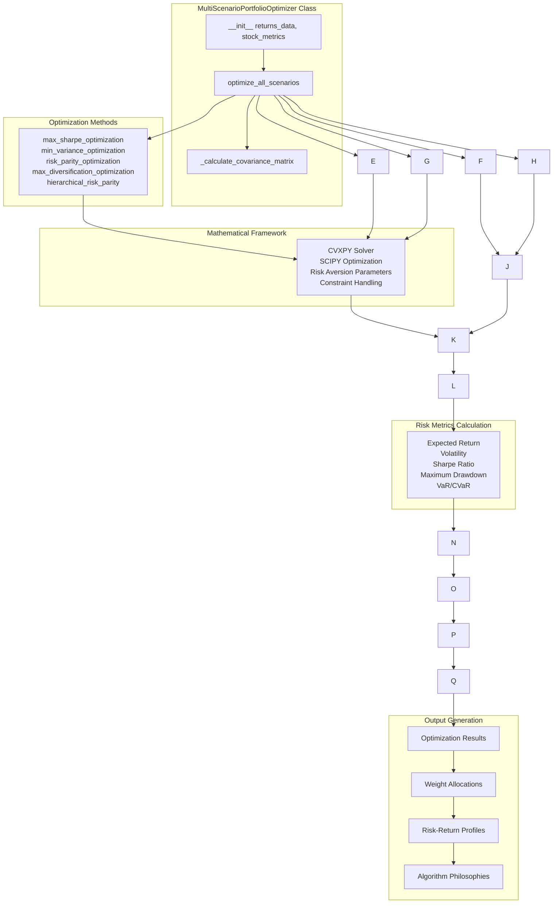
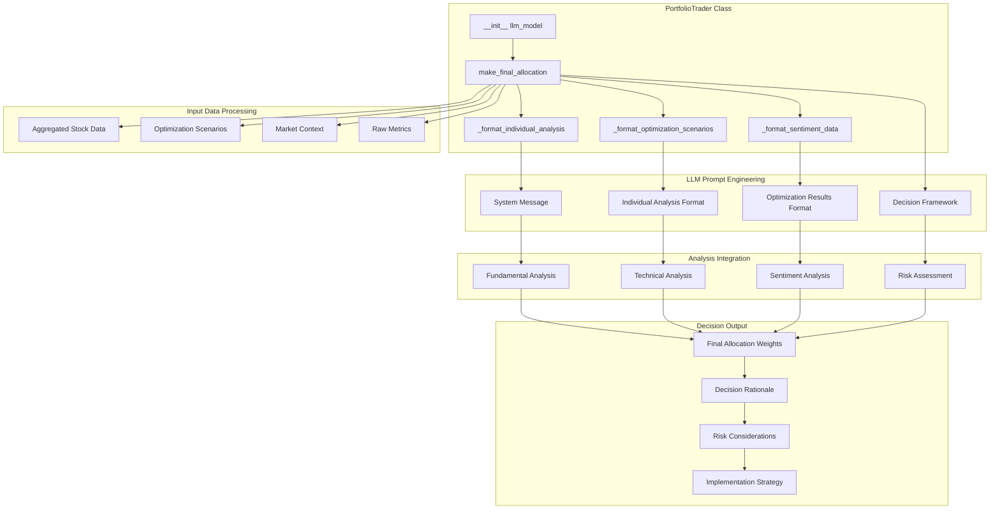
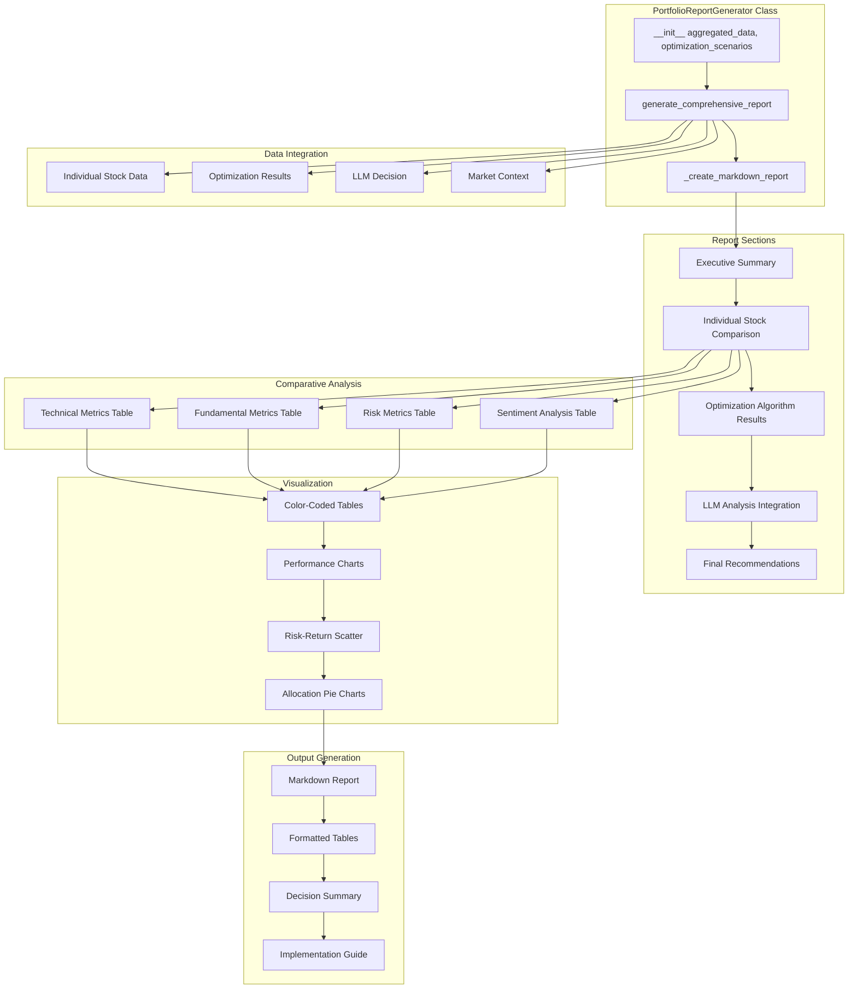
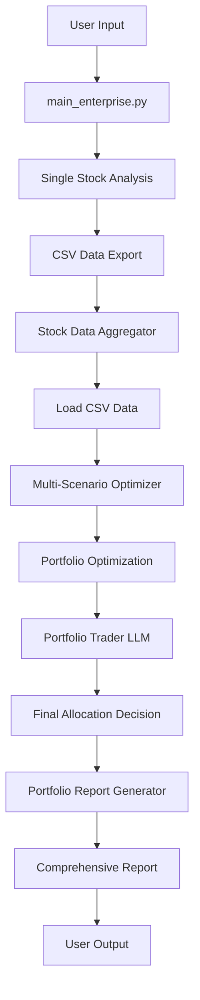

# TradingAgents Portfolio System Architecture

## Portfolio System Overview

## Stock Data Aggregator Detailed Architecture

## Multi-Scenario Portfolio Optimizer Detailed Architecture

## Portfolio Trader LLM Architecture

## Portfolio Report Generator Architecture

## Data Flow Architecture

