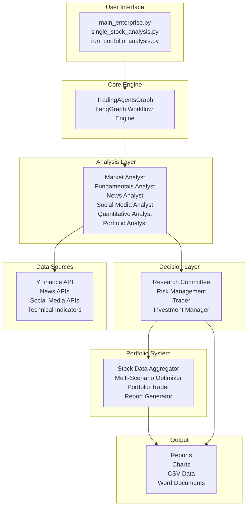
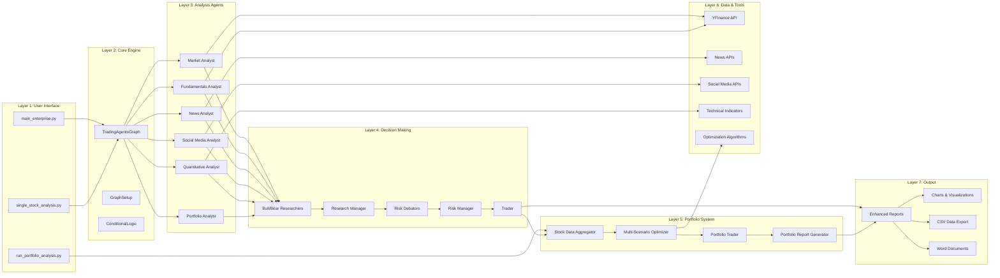

# TradingAgents Project Architecture

## System Architecture Overview

## Detailed Architecture Layers

## System Components Detail

### 1. User Interface Layer
- **main_enterprise.py**: Main entry point for enterprise analysis
- **single_stock_analysis.py**: Lightweight single stock analysis
- **run_portfolio_analysis.py**: Standalone portfolio analysis

### 2. Core Graph Engine
- **TradingAgentsGraph**: Main workflow orchestrator using LangGraph
- **GraphSetup**: Configures agent nodes and edges
- **ConditionalLogic**: Controls workflow branching and decision points

### 3. Agent Layer (Analysts)
- **Market Analyst**: Market conditions and macro analysis
- **Fundamentals Analyst**: Financial statement and company analysis
- **News Analyst**: News sentiment and impact analysis
- **Social Media Analyst**: Social sentiment analysis
- **Quantitative Analyst**: Technical indicators and ML forecasting
- **Portfolio Analyst**: Comparative analysis across stocks
- **Enterprise Strategy Analyst**: Strategic business analysis

### 4. Research & Risk Management
- **Bull/Bear Researchers**: Generate opposing viewpoints
- **Research Manager**: Synthesizes research findings
- **Risk Debators**: Assess risk from different perspectives
- **Risk Manager**: Final risk assessment and approval

### 5. Decision Making
- **Trader**: Generates execution plans
- **Investment Manager**: Makes final investment decisions

### 6. Report Generation
- **Enhanced Document Generator**: Creates comprehensive reports
- **Comprehensive Charts**: Generates visualizations
- **CSV Data Exporter**: Exports structured data

### 7. Portfolio System
- **Stock Data Aggregator**: Collects and standardizes data
- **Multi-Scenario Optimizer**: Runs portfolio optimization algorithms
- **Portfolio Report Generator**: Creates portfolio reports
- **Portfolio Trader**: LLM-based portfolio allocation decisions

### 8. Data & Tools
- **YFinance API**: Stock data and financial information
- **News APIs**: News sentiment analysis
- **Social Media APIs**: Social sentiment data
- **Technical Indicators**: Technical analysis calculations
- **Optimization Algorithms**: Portfolio optimization methods

### 9. State Management
- **AgentState**: TypedDict for state persistence
- **Memory Systems**: Conversation and context memory
- **Toolkit**: Shared tools and utilities