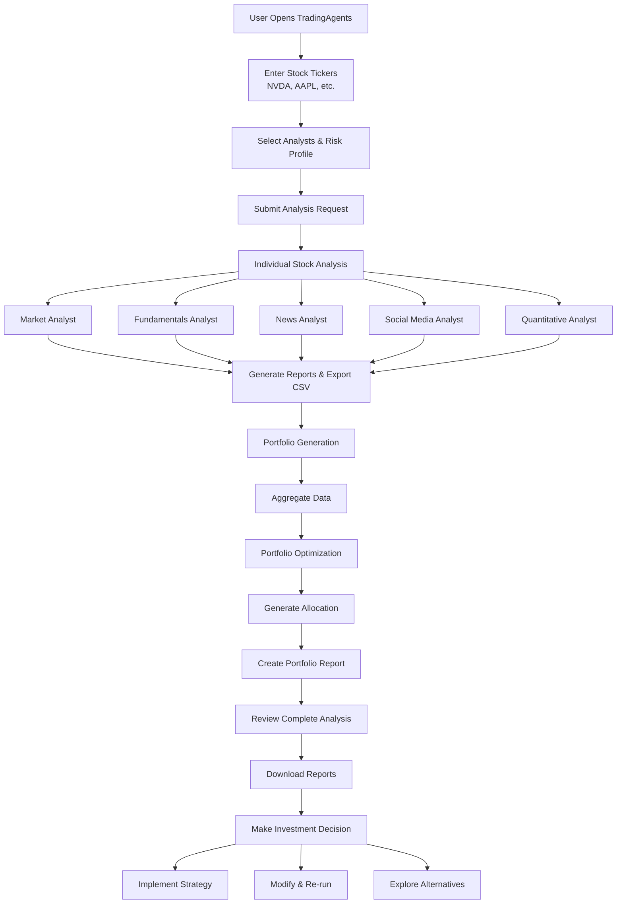

# TradingAgents User Workflow Diagram

## Complete User Workflow

## Key User Steps

### 1. **Input & Configuration**
- Enter stock tickers (e.g., NVDA, AAPL)
- Select analysts (Market, Fundamentals, News, Social, Quantitative)
- Set risk tolerance and investment objectives

### 2. **Analysis Execution**
- System runs individual stock analysis for each ticker
- Generates comprehensive reports and exports CSV data
- Automatically proceeds to portfolio generation

### 3. **Portfolio Generation**
- Aggregates data from individual stock analyses
- Runs multiple optimization algorithms
- Generates portfolio allocation recommendations
- Creates comprehensive portfolio report

### 4. **Review & Decision**
- Review individual stock reports
- Analyze portfolio allocation recommendations
- Make investment decisions based on results
- Download reports and data for further analysis

## System Features

- **Automated Pipeline**: Single stock analysis → Portfolio generation
- **Multi-Analyst Approach**: Comprehensive analysis from multiple perspectives
- **Portfolio Optimization**: Advanced algorithms for allocation decisions
- **Export Capabilities**: CSV data and formatted reports
- **Risk Management**: Built-in risk assessment and scenario analysis