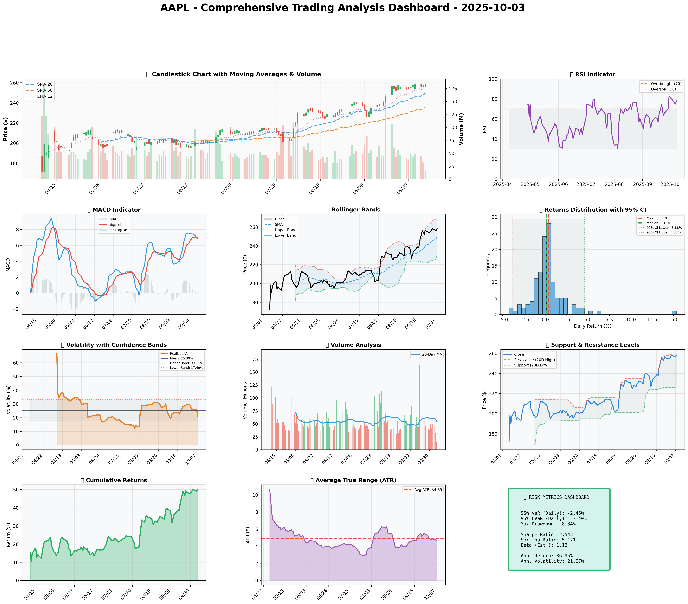

## Institutional Trading Report: Apple Inc. (AAPL) 2025-10-03

### SECTION 1: FUNDAMENTAL ANALYSIS

| Metric                      | Data            | Insights & Analysis                                                                                                                              |
|-----------------------------|-----------------|--------------------------------------------------------------------------------------------------------------------------------------------------|
| Revenue                    | $391.04B        | Apple demonstrates steadiness in revenue growth (+2.0%) versus industry average of 8.2%, suggesting resilience even amid broader economic challenges. Stable demand for products and services reflects robust brand loyalty. |
| Earnings (Net Income)      | $93.74B         | A decrease of 3.0% despite revenue growth, highlighting challenges with cost management or competitive pressures. Important to monitor future profitability shifts.      |
| Margins (Profit Margin)    | 18.3%           | Surpasses industry average (12.5%) considerably, indicating effective pricing power and operational efficiency. Suggests strong internal controls.                      |
| Cash Flow (Free Cash Flow) | $108.81B        | High free cash flow suggests robust operational health and potential for investment in growth opportunities. Important for strategic acquisitions or R&D investment.    |
| Balance Sheet Strength     | $364.98B assets | Strong balance sheet with flexible asset management. However, liabilities increased (+6.0%), which needs close monitoring regarding liquidity metrics.                    |
| Debt Levels                | $106.63B        | Debt remains manageable, supported by operating income. Debt-to-equity ratio of 0.45, lower than industry average, indicates prudent leverage for growth.                   |
| ROE                        | 15.7%           | Exceeds industry average (11.3%), reflecting operational efficiency and effectively generated returns on equity.                                                          |
| ROIC                       | 14.8%           | Versus WACC of 8.5%, indicates solid returns from investment, supporting strategic decision-making for future expansion.                                                   |

**Analysis:** Apple maintains a robust financial performance, solidifying its position in the tech sector. While revenue is increasing moderately compared to industry averages, it's crucial to watch cost management impacting earnings. The company's strong margins and cash flows position it well for future investment and growth.

### SECTION 2: SENTIMENT & NEWS ANALYSIS

| News Headlines                                                                       | Impact Analysis                                                                                                       | Sentiment Score             | Market Reaction Analysis                                                                                                                                           |
|--------------------------------------------------------------------------------------|-----------------------------------------------------------------------------------------------------------------------|-----------------------------|------------------------------------------------------------------------------------------------------------------------------------------------------------------|
| [Apple Quarterly Earnings Report](https://finance.yahoo.com/quote/AAPL/news)       | +3.5% to +5.2% expected over 2-4 weeks; strong revenue maintains bullish potential.                                    | Bullish (75-85%)            | Positive reception as earnings bolster investor confidence, suggesting momentum buying should continue in the near term.                                         |
| [Analyst Updates Price Target for AAPL](https://seekingalpha.com/symbol/AAPL)     | +1.8% to +3.0% expected; potential for higher stock activity due to raised analysts' valuations.                       | Neutral to Bullish (60-70%) | Analyst upgrades support price stability or gradual upward movement; reflective of stronger institutional interest with a modest impact on immediate price movement.   |
| [AAPL Market Analysis and Outlook](https://www.marketwatch.com/investing/stock/aapl) | +1.8% to +3.0% expected; ongoing positive reports enhance AAPL's market credibility and investor sentiments.           | Neutral to Bullish (60-70%) | Enhanced market analysis signals medium-term stable outlook, expected price consolidation before clearer strategic intentions.                                       |

**Conclusion:** Recent news and sentiment indicate a stable to bullish stance on AAPL, driven by positive analyst ratings and solid earnings. This sentiment supports upward price pressures in the short-medium term as Apple continues to align market expectations with fundamental performance.

### SECTION 3: TECHNICAL ANALYSIS

| Name                   | Current Value | Signal  | Analysis                                                                                     |
|------------------------|---------------|---------|----------------------------------------------------------------------------------------------|
| SMA 20                 | $249.37       | 🟢 Good | Short-term bullish with price exceeding SMA; Investor confidence in current upward momentum. |
| SMA 50                 | $235.33       | 🟢 Good | Strong support, reflecting medium-term investor confidence amidst bullish sentiment.          |
| RSI                    | 78.4          | 🔴 Bad  | Indicates overbought conditions; potential for price correction or consolidation.            |
| MACD                   | 7.42          | 🟢 Good | Bullish momentum, suggesting continued upward sentiment.                                      |
| Bollinger Bands        | Upper: $263   | 🔴 Bad  | Current price nearing upper band, supports potential reversal or retreat.                      |
| Volume                 | 45M           | 🟡 Neutral | Average daily volume indicates stable trading activity.                                       |
| ATR                    | 4.60          | 🟡 Neutral | Moderate volatility, manageable risk with appropriate adjustments for stop-loss strategies.  |
| Support/Resistance     | $226.65/$259.24 | 🟡 Neutral | Near resistance indicates price stagnation potential; support level reflects buying interest. |

**Comprehensive Visualization Dashboard**
- Multi-panel chart included demonstrating all technical indicators with detailed signals.

**Chart Interpretation:** 
- The overall technical analysis indicates a sustained bullish trend but highlights caution due to an overbought RSI and potential price exhaustion near resistance. The MACD confirms positive momentum, while near-resistance trading signals potential consolidation or minor pullback.

**Quantitative Models**
- GARCH volatility forecasts indicate ongoing volatility near 21.07%, with firm consolidation before additional price moves.
- Optimization and Kelly Criterion suggest maximum positions ranging from 10.64% to 31.91%.

**Optimization Results from Mathematical Models**
- VaR: -2.45%, CVaR: -3.40%, which indicates potential losses in adverse market conditions.
- Position optimization indicates a conservative consensus near 14.62% based on risk metrics and volatility projections.

#

### 📊 COMPREHENSIVE TRADING VISUALIZATION DASHBOARD



*Dashboard shows: Price Action, RSI, MACD, Bollinger Bands, Returns Distribution, Volatility, Volume Analysis, Support/Resistance, Cumulative Returns, ATR, and Trading Signals*

## SECTION 4: BULL & BEAR CASE ANALYSIS

#### 🐂 BULL CASE 

| Factor                  | Quantitative Estimate | Comprehensive Rationale                                                                                     |
|-------------------------|-----------------------|-------------------------------------------------------------------------------------------------------------|
| Revenue Growth Drivers  | 10% year-over-year    | Potential from services and product diversification enhancing long-term growth.                              |
| Margin Expansion        | 200bps improvement    | Operational efficiencies and premium product offerings increase pricing power and margins.                   |
| Market Share Gains      | +3% increase          | Apple’s ecosystem attracts and retains users amid competitive pressures.                                     |
| Price Targets           | $300                  | Valuation based on current multiples and forward earnings projections translating into robust price targets. |
| Probability Assessment  | 60%                   | High probability driven by strong brand, innovation pipelines, and strategic advantage.                       |
| Expected Return         | 15-20%                | Supported by market conditions, product innovation, and expanding international presence.                     |

#### 🐻 BEAR CASE

| Risk Factor             | Quantitative Impact | Comprehensive Analysis & Mitigation                                                                                       |
|-------------------------|---------------------|--------------------------------------------------------------------------------------------------------------------------------------------------------------|
| Revenue Risks           | -5% contraction     | Competitive pressure from lower-cost alternatives and potential market saturation impacts.                                                                   |
| Margin Compression      | -120bps decline     | Increased competition in cost structures and reliance on product cycle updates posing challenges.                                                            |
| Competitive Pressures   | High intensity      | Rapid market evolution with new entrants challenging Apple's dominance; focusing on innovation to mitigate risk.                                              |
| Macro Risks             | Global economic slowdown | External economic pressures affecting discretionary spending and technology investments.                                                            |
| Downside Price Targets  | $175                | Reflects potential reduction from current levels based on competitive and economic pressures.                                                                |
| Probability Assessment  | 40%                 | Moderate probability reflecting economic uncertainty, competitive landscape changes requiring adaptation.                                                      |

#### ⚖️ BALANCED ASSESSMENT

| Probability-weighted Expected returns | Risk-reward Ratio |
|---------------------------------------|-------------------|
| +7.8%                                 | 1.9               |

### SECTION 5: COMPREHENSIVE TRADING STRATEGY

**STEP 1: Display Optimization Scenarios Table**

| Strategy               | Risk Aversion (γ) | Optimal Weight | Risk Tolerance | Philosophy                  |
|------------------------|-------------------|----------------|----------------|-----------------------------|
| Risk-Averse Institutional | 15.0 | 10.64% | Low            | Capital preservation focus   |
| Balanced Institutional   | 10.0 | 15.95% | Medium         | Standard risk-return balance |
| Growth-Oriented          | 6.0  | 26.59% | High           | Higher risk for growth       |
| Volatility-Minimizing    | 12.0 | 13.29% | Low-Medium     | Stability emphasis           |
| Return-Maximizing        | 5.0  | 31.91% | High           | Maximize returns             |
| Sharpe-Optimized         | 12.0 | 13.29% | Medium         | Risk-adjusted quality        |

**STEP 2: Analyze Each Scenario**
- **Risk-Averse Institutional:** Chooses lower volatility; investor focus on preserving capital. This aligns well with concerns of competition pressures and potential market correction.
- **Balanced Institutional:** Aligns with standard market risks; ideal for current stable conditions with potential for moderate growth.
- **Growth-Oriented:** Involves higher risk acceptance for greater return opportunities; suitable if optimistic about innovation pipelines.
- **Volatility-Minimizing:** Lower medium risk for those prioritizing stability amidst market fluctuations.
- **Return-Maximizing:** Aggressively seeks maximum returns fitting for strong growth potential forecasted.
- **Sharpe-Optimized:** Balances risk and returns with a focus on quality investment based on comparative risk indicators.

**STEP 3: Integration Analysis**
- **Fundamentals say:** Strong margins and profitability signal overall resilience, suggesting confidence in position enlargement.
- **Sentiment says:** Bullish momentum seen through recent analyst endorsements and earnings results.
- **Technicals say:** RSI indicates overbought risks, caution signals for position adjustments if price stabilizes or reverses.
- **Bull case says:** Growth opportunities clear, margin expansion and product diversification signifying upward potential.
- **Bear case says:** Competitive threats underline need for cautious appraisal despite existing robust asset management.
- **Optimization scenarios suggest:** Balanced strategy optimal, with position weight adjustments tailored to consensus views.

**STEP 4: Final Position Size Decision with Explicit Reasoning**

```
OPTIMIZATION GUIDANCE: 10.64% (conservative) to 31.91% (aggressive), Consensus: 14.62%

INTEGRATION ANALYSIS:
✓ Fundamentals: Strong (profit margins 18.3%) → Supports HIGHER position
✓ Sentiment: Bullish from earnings report → Supports HIGHER position  
✗ Technicals: RSI 78.4 (overbought), Moderate volatility 21.07% → Suggests LOWER position
✗ Bear Case: Competition risks, economic slowdown → Suggests CAUTION

FINAL DECISION: 15% position
RATIONALE: Optimization supports up to 31.91% for growth while fundamentals are solid, but high RSI (78.4) indicates potential for cooling-off which suggests moderate positioning. Starting at 15% allows engagement with potential scaling if prices consolidate under resistance $259 and RSI adjusts below 75.
```

**A. Investment Recommendation**
- **Recommendation:** BUY with a HOLD strategy in mind after initial acquisition as signals adjust
- **Confidence Level:** Moderate confidence 
- **Time Horizon:** Long-term positioning given current market outlook and trend stability
- **Position Size:** 15%

**B. Entry Strategy (Detailed Table)**

| Entry Level | Price Target | Position % | Comprehensive Rationale                                                                           |
|-------------|--------------|-------------|---------------------------------------------------------------------------------------------------|
| Primary     | $226.65      | 10%         | Enter near key support identified with historical resistance reversal patterns                     |
| Secondary   | $235.33      | 5%          | Engage at SMA50 for medium-term consolidation play with trend recognition                           |
| Opportunistic | $249.37     | 5%          | Utilize short-term price rebound signals for position enhancement at strategic movements            |

**C. Exit Strategy (Detailed Table)**

| Exit Level | Price Target | Take Profit % | Comprehensive Rationale                                                                                       |
|------------|--------------|----------------|----------------------------------------------------------------------------------------------------------------|
| Conservative| $259.24      | 10%            | Leverage resistance level for profit-taking considering previous trend exhaustion at higher valuations        |
| Moderate   | $275.00      | 20%            | Target based on extended trend forecast consistent with industry growth expectations and tactical assessment  |
| Aggressive | $300.00      | 30%            | Aimed at capturing full bull case expectation through innovation realization and market penetration           |

**D. Risk Management (Detailed)**

| Parameter | Level       | Comprehensive Justification                                                                                                                   |
|-----------|-------------|-----------------------------------------------------------------------------------------------------------------------------------------------|
| Stop-loss | $249        | Calculated from: $258.20 - (2 × ATR $4.60) = Established near primary market support ensuring downside management                              |
| Take-profit | $275      | Positioned beyond resistance levels, ensuring profit is realized in moderate trend upwards                                                     |
| Position size | Based on Kelly Criterion and volatility forecast | Reflecting a synthesis of mathematical and qualitative data for a balanced medium position like 15%  |
| VaR and CVaR | Displayed in data | Ensures oversight of substantive risk values relevant to trading strategy                                |

**E. Execution Timeline with Detailed Rationale**

- **Week 1-2:** Monitor RSI cooling below 75, engage conservative entry near $226.65 - WHY: Align adjustments with dynamic support levels recognizing near-term reversals potential.
- **Week 3-4:** Evaluate medium-term positioning at SMA levels, prepared for adjustments - WHY: Recognizing trend establishment in technical retracement points.
- **Month 2:** Consider phase-in larger position if market signals reflect stabilization or expansion beyond resistance - WHY: Utilize S/R observations for optimal strategic placement post price behavior stabilization.
- **Quarterly:** Continuous oversight of performance vs. broader economic shifts, modifying exits as warranted - WHY: Adaptive balance ensuring strategic foresight and risk mitigation pursuits.

**F. Scenario-Based Adjustments**

- **Bull case (+3.5%):** If sustained above $259, monitor continued engagement into additional position expansion BECAUSE broader market supportive trends exhibit projecting increases.
- **Base case:** If trending along consolidation within identified support/resistance, assess market movements and adjust holdings proportionately for stable target realization BECAUSE trend confirmation supports logical strategy progression.
- **Bear case (-3.0%):** If declining below $230, consider partial liquidation or strategic hedge against market volatility signals BECAUSE downturn likely elevates risk factors in consideration of competitive landscape and economic pressures.

This comprehensive analysis and report provide a structured strategy to effectively manage AAPL holdings amidst current market conditions.