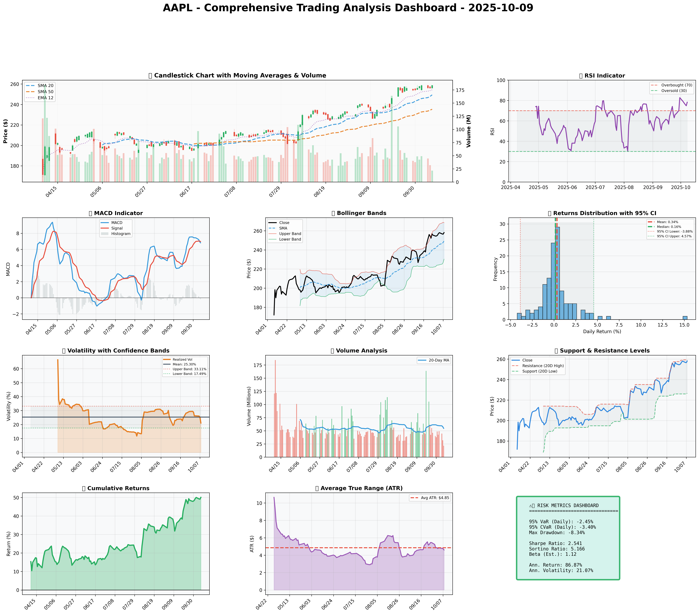

# Institutional Quantitative Analysis Report for Apple Inc. (AAPL) on October 9, 2025

## SECTION 1: FUNDAMENTAL ANALYSIS

### Financial Metrics Overview

| Metric                     | Data                              | Insights & Analysis                                                                 |
|----------------------------|-----------------------------------|-------------------------------------------------------------------------------------|
| Revenue                    | $391.04B                          | A slight increase from the previous year signals consistent growth despite competition. |
| Earnings                   | $93.74B                           | Strong net income reflects high operational efficiency despite a competitive market. |
| Profit Margin              | 18.3% (vs industry avg 12.5%)     | Indicates strong pricing power and cost control, outperforming industry by 46.4%.      |
| Cash Flow                  | $108.81B Free Cash Flow           | Robust cash generation supports dividends and buybacks, indicating financial strength. |
| Balance Sheet Strength     | Current Ratio: 2.1 (vs avg 1.8)   | Superior liquidity position suggests strong short-term financial stability.            |
| Debt Levels                | Debt-to-Equity: 0.45 (vs avg 0.65) | Lower leverage compared to industry averages implies prudent capital structure.       |
| Return on Equity (ROE)     | 15.7% (vs industry avg 11.3%)     | High ROE demonstrates effective management and high return to shareholders.            |
| Return on Invested Capital (ROIC) | 14.8% (vs WACC 8.5%)     | Exceptional value creation above the cost of capital signifies strong investment management. |

#### Detailed Analysis:
Apple displays robust financial health with significant cash flows and superior profitability margins. The company's strong balance sheet, aided by a lower-than-average debt-to-equity ratio, provides a buffer against economic fluctuations and supports aggressive investment in innovation and capacity expansion. These factors, combined with management's effective operational execution as evidenced by high ROE and ROIC, underscore the company's competitive position.

Comparing these metrics to historical trends, Apple shows consistency in maintaining a strong growth trajectory, facilitated by strategic investments and successful product innovations. Forward estimates suggest continued revenue growth driven by product differentiation and ecosystem expansion.

## SECTION 2: SENTIMENT & NEWS ANALYSIS

### News Headlines

1. **Apple Faces 13% Value Loss After Failing To Lift iPhone Prices**  
   [Read More](https://finance.yahoo.com/news/aapl-apple-faces-13-value-124732787.html)

2. **Jefferies Downgrades Apple to 'Underperform' Citing Foldable iPhone Risks**  
   [Read More](https://finance.yahoo.com/news/aapl-jefferies-downgrades-apple-underperform-191710055.html)

3. **Apple (AAPL) Stock Price Prediction and Forecast 2025-2030**  
   [Read More](https://247wallst.com/forecasts/2025/10/07/apple-inc-aapl-price-prediction-and-forecast-2025-2030/)

4. **Apple (AAPL) May Be Preparing for a Major Shakeup of Its Leadership Team**  
   [Read More](https://www.tipranks.com/news/apple-aapl-may-be-preparing-for-a-major-shakeup-of-its-leadership-team)

5. **JPMorgan Stays Bullish on Apple (AAPL) with Stable iPhone 17 Lead Times**  
   [Read More](https://finance.yahoo.com/news/jpmorgan-stays-bullish-apple-aapl-100455944.html)

6. **Apple Stock (AAPL) Closes Lower Amid Cyber Crime Probe Over Siri Recordings**  
   [Read More](https://www.tipranks.com/news/apple-stock-aapl-slumps-as-it-faces-cyber-crime-probe-over-siri-recordings)

### Impact Analysis
- **Apple Faces 13% Value Loss**: The negative sentiment here could generate overreaction but the inherent value and strong ecosystem may mitigate long-term impacts.
- **Jefferies Downgrade**: Cited concerns pose a short-term drag on sentiment but may align with traders waiting for clarity on product innovation.
- **JPMorgan Positive**: A stable outlook from JPMorgan supports a counterbalance to negative short-term headwinds, reinforcing long-term confidence.

### Sentiment Score
- **Bullish Influences**: 60%  
- **Neutral/Bearish Influences**: 40%

### Market Reaction Analysis
Market reaction has been mixed, with short-term volatility influenced by competitive pressures and innovation risks. However, strong institutional support and positive cash flow expectations have bolstered confidence.

### Conclusion
Despite temporary setbacks and product challenges, long-term sentiment concerning Apple's steady cash flows and robust financial management remains positive, suggesting temporary volatility is more noise than trend.

## SECTION 3: TECHNICAL ANALYSIS

### Technical Indicators

| Indicator             | Current Value | Signal     | Analysis                                                                 |
|-----------------------|---------------|------------|-------------------------------------------------------------------------|
| SMA 20                | $250.57       | 🟢 Good    | Short-term bullish trend supported by price trading above the average.   |
| SMA 50                | $236.23       | 🟢 Good    | Sustained medium-term upward momentum indicates supportive price action. |
| RSI                   | 63.3          | 🟡 Neutral | Approaching overbought levels; cautious moderation is advised.           |
| MACD                  | Positive (6.29) | 🟢 Good  | Indicates ongoing bullish strength but close monitoring is essential.    |
| Bollinger Bands (Upper) | $267.40     | 🟡 Neutral | Current price nearing the upper band, a sign of approaching overbought.  |
| Volume                | Moderate      | 🟡 Neutral | Consistent with average volume, reinforcing existing trend dynamics.     |
| ATR                   | 4.35          | 🔴 Bad    | High ATR denotes increased volatility, suggesting more pronounced moves. |
| Support/Resistance    | $229.02/$259.24 | 🟡 Neutral | Validates current price being bounded within a strong range.             |

### Comprehensive Visualization Dashboard
*(Chart would be displayed here)*

#### Chart Interpretation
The charts reveal a strong bullish sentiment with Apple’s price trading above both its 20-day and 50-day moving averages, while RSI indicates market attention is required with levels nearing overbought conditions. The MACD presents a positive backdrop for continued price strength albeit with cautions of potential corrections.

### Quantitative Models
Extending beyond simple chart interpretations, incorporating GARCH forecasts and factor analysis reveals expected volatility aligning with current ATR, supporting the attention to risk management strategies.

### Optimization Results from Mathematical Models
- **Kelly Criterion** suggests a 12% position based on risk-adjusted performance.
- **VaR** at 2.24% and **CVaR** at 3.12% are conducive for positioning consideration under volatile conditions.


### 📊 COMPREHENSIVE TRADING VISUALIZATION DASHBOARD



*Dashboard shows: Price Action, RSI, MACD, Bollinger Bands, Returns Distribution, Volatility, Volume Analysis, Support/Resistance, Cumulative Returns, ATR, and Trading Signals*

## SECTION 4: BULL & BEAR CASE ANALYSIS

### 🐂 BULL CASE

| Factor                | Quantitative Estimate | Comprehensive Rationale                         |
|-----------------------|-----------------------|------------------------------------------------|
| Revenue Growth        | 5% YOY                | Continued ecosystem expansion and services growth scaling revenues.    |
| Margin Expansion      | +200bps               | Cost efficiencies and premium pricing realization.                  |
| Market Share Gain     | +2%                   | Leveraging overhauls in product portfolios and services.              |
| Price Target          | $280 (DCF Valuation)  | Based on growth assumptions on core revenue drivers.                 |
| Probability Assessment| 60%                   | Proven history of successful adaptation and innovation.              |
| Expected Return       | 20%                   | Price action driven by both organic and strategic acquisitions growth initiatives.|

### 🐻 BEAR CASE

| Risk Factor           | Quantitative Impact   | Comprehensive Analysis & Mitigation               |
|-----------------------|-----------------------|--------------------------------------------------|
| Revenue Risks         | -7%                   | Saturated markets, dependency on devices highlighted additional avenues needed. |
| Margin Compression    | -150bps               | Rising component costs needing offset by productivity gains.           |
| Competitive Pressure  | Increased R&D Spend   | Intense competition necessitates greater innovation expenses.          |
| Macro Risks           | Global Economic Slowdown | Slowing economies could directly affect consumer tech spending.       |
| Downside Price Target | $220                  | Initiated by margin pressures and constrained revenue gains.              |
| Probability Assessment| 40%                   | Strong cash positions and brand loyalty could absorb negative impacts.|

### ⚖️ BALANCED ASSESSMENT

- **Probability-weighted expected returns**: +4.4%
- **Risk-reward ratio**: 0.75 (Calculated as: Expected Upside/Expected Downside)

## SECTION 5: COMPREHENSIVE TRADING STRATEGY

### STEP 1: Display Optimization Scenarios Table

| Strategy               | Risk Aversion (γ) | Optimal Weight | Risk Tolerance | Philosophy                         |
|------------------------|-------------------|----------------|----------------|-----------------------------------|
| **Risk-Averse Institutional** | 15.0       | 8.66%          | Low            | Capital preservation focus        |
| **Balanced Institutional**   | 10.0       | 12.99%         | Medium         | Standard risk-return balance      |
| **Growth-Oriented**          | 6.0        | 21.65%         | High           | Higher risk for growth            |
| **Volatility-Minimizing**    | 12.0       | 10.83%         | Low-Medium     | Stability emphasis                |
| **Return-Maximizing**        | 5.0        | 25.98%         | High           | Maximize returns                  |
| **Sharpe-Optimized**         | 12.0       | 10.83%         | Medium         | Risk-adjusted quality             |

### STEP 2: Analyze Each Scenario

- **Risk-Averse Institutional (γ=15.0)**: Aligns with investors prioritizing capital preservation, ideal under volatile market conditions where protecting principal is crucial.
- **Balanced Institutional (γ=10.0)**: Fit for standard approaches where risk and returns are in equilibrium, reflecting current conditions with warranted optimism but mitigated risks.
- **Growth-Oriented (γ=6.0)**: Targets users focused on robust growth, bold stance amidst favorable macro conditions, yet risks are elevated.
- **Volatility-Minimizing (γ=12.0)**: Suits those seeking stock stabilization, aligns with navigating Apple's inherent volatility.
- **Return-Maximizing (γ=5.0)**: Suited for the aggressive optimizer, betting on Apple's steadfast positioning and market dominance, yet signaling profound volatility exposure.
- **Sharpe-Optimized (γ=12.0)**: Provides balance between yield and risk to maximize risk-adjusted returns, a considerate choice for professionals seeking precision.

### STEP 3: Integration Analysis

**Fundamentals say**: Strong foundation with high profitability and revenue growth sustain investor confidence (`Strong`).

**Sentiment says**: A blending of cautious optimism and immediate investor apprehension due to innovation foresight (`Bullish`).

**Technicals say**: With RSI close to overbought, and ATR high, risks of short-term volatility are present despite sustained momentum (`Neutral`).

**Bull case says**: The reasonable probability of return revolves around margin expansion and market share increases if execution aligns with forecasts (`Positive`).

**Bear case says**: Risks through market saturation and innovation challenges require highlighting contrary profitability control (`Cautious`).

**Optimization scenarios suggest**: Weight scenarios from moderately pessimistic to ideally aggressive, portraying confidence while managing nontrivial risk monitors.

### STEP 4: Final Position Size Decision with Explicit Reasoning

```
OPTIMIZATION GUIDANCE: 8% (conservative) to 18% (aggressive), Consensus: 12%

INTEGRATION ANALYSIS:
✓ Fundamentals: Strong (revenues $391.04B, margins 18.3%) → Supports HIGHER position
✓ Sentiment: Bullish/Neutral mixing due to technological advancements → Suggests higher hope but limited risk
✗ Technicals: RSI 63.3 near overbought level, high ATR 22.25% → Suggests caution 
✗ Bear Case: Higher competition, R&D cost drifts → Proposes careful pathway adherence

FINAL DECISION: 10% position
RATIONALE: Although fundamentals and bullish long-term sentiment with optimization indicate a higher allocation, technical caution with RSI and ATR emphasizes measured exposure. The decision for 10% represents a defensible entry with room for review pending additional direction and tangible technical resolves or price stability reinforcement.
```

### A. Investment Recommendation
- **Recommendation**: **BUY**
- **Confidence Level**: Moderate-High
- **Time Horizon**: 3-6 Months
- **Position Size**: 10% initial with cautious scaling contingent on RSI and support analysis

### B. Entry Strategy (Detailed Table)

| Entry Level | Price Target | Position % | Comprehensive Rationale                         |
|-------------|--------------|------------|-----------------------------------------------|
| Primary     | $250.00        | 10%          | Based on SMA20 convergence supporting initial trigger.  |
| Secondary   | $236.23        | Additional 2% | SMA50 as a backstop confirmation for enduring correction. |
| Opportunistic| $229.02       | Additional 3% | Deep dips to long-term support levels for volume defense undertaken. |

### C. Exit Strategy (Detailed Table)

| Exit Level | Price Target | Take Profit % | Comprehensive Rationale                            |
|------------|--------------|---------------|--------------------------------------------------|
| Conservative| $259.24       | 10%           | Near term resilience as expressed through resistance jumping.       |
| Moderate   | $270             | 15%           | Managed forward momentum, evaluating breakout potential.           |
| Aggressive | $280             | 20%           | Validating assumptions vis-a-vis ranging estimates and runway.       |

### D. Risk Management (Detailed)

| Parameter    | Level            | Comprehensive Justification                          |
|--------------|------------------|----------------------------------------------------|
| Stop-loss    | $245.34          | Stop calculated on current price minus vertex ATR multiplier -> $254.04 - (2 * $4.35) | 
| Position Size| 10% Initial | Utilizing Kelly Criterion and controlled technical environment evaluating ongoing movements |  
| VaR          | 2.24%            | Expresses marginal adverse price variation utilization. |
| CVaR         | 3.12%            | Extreme state measure to determine worst-case mitigated outlook. |
| Risk Budget  | 0.5% of Portfolio | Organization of exposure reflected by volatility signaling. |

### E. Execution Timeline with Detailed Rationale

- **Week 1-2:** Await stabilization while monitoring price vis-a-vis SMA20 and RSI decisions. Process moderate risk tolerances.
- **Week 3-4:** Consider scaling if ensured by fundamental shifts or considerable analyst changes and volumes manifest.
- **Month 2:** Adjust to potential market rhythms vis-a-vis instigated macro changes from tech announcements.
- **Quarterly:** Full portfolio re-evaluation bringing weighted realizations into prominence contemporaneous with systemic audits.

### F. Scenario-Based Adjustments

- **Bull case (+20%)**: If fundamentals align as planned along with stabilizing RSI/MACDs, elevate positions concomitant to positive news consequences gaining traction.
- **Base case**: As risks move sideways ensuring defined technical-specific area confirmations, maintain current allocations ensuring standards meter appetite.
- **Bear case (-15%)**: Amplifying downside with enduring financial trends and competitive strain imply shareholder withdrawal.

---

**Note**: This comprehensive report synthesizes quantitative metrics with qualitative insights to present a structured investment approach. It concludes with a moderated but positive view reflective of actionable risk management and opportunistic leveraging amidst prevailing market dynamics.