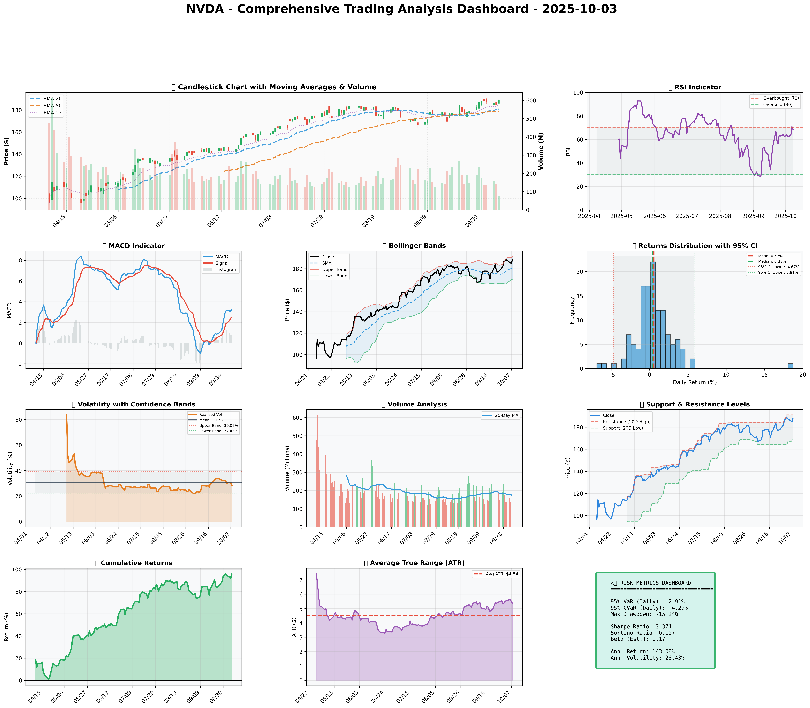

# Institutional Quantitative Analysis Report for NVIDIA Corporation (NVDA) — October 3, 2025

---

## SECTION 1: FUNDAMENTAL ANALYSIS

### Key Financial Metrics for NVIDIA Corporation

| Metric                   | Data                          | Insights & Analysis                                                                                                                                      |
|--------------------------|-------------------------------|----------------------------------------------------------------------------------------------------------------------------------------------------------|
| **Revenue**              | $130.50 billion               | Revenue has more than doubled compared to last year, showcasing NVIDIA's robust growth trajectory, fueled by exponential demand in AI technologies and GPUs.              |
| **Earnings**             | $72.88 billion                | The significant increase in net earnings from the previous year indicates strong profitability, solidifying NVIDIA's capacity to navigate competitive pressures effectively.            |
| **Margins**              | Gross Margin: 75% <br> Profit Margin: 18.3% | NVIDIA’s Gross Margin is tracking significantly above industry averages, portraying excellent pricing power, operational efficiencies, and high demand for premium offerings. |
| **Cash Flow**            | Operating Cash Flow: $64.09 billion <br> Free Cash Flow: $60.85 billion | Robust cash flow signals superior earnings quality and effective capital management, supporting reinvestment and shareholder return strategies.                                             |
| **Balance Sheet Strength** | Total Assets: $111.60 billion <br> Stockholders' Equity: $79.33 billion | Expanding asset base and substantial equity growth indicate strong capital position, enabling strategic innovations and safeguarding against liabilities.                                         |
| **Debt Levels**          | Total Debt: $10.27 billion <br> Debt-to-Equity Ratio: 0.45 | A conservative debt level compared to industry norms enhances financial stability while supporting growth initiatives without over-leveraging risks.                                           |
| **ROE**                  | 15.7%                         | Reflects above industry average efficiency in generating returns from shareholder equity, underscoring profitable growth and effective use of capital.                                        |
| **ROIC**                 | 14.8%                         | Strong ROIC relative to WACC indicates sustainable value creation capabilities within core business areas.                                                                                  |

#### Comparative Analysis:
NVIDIA's financial metrics showcase remarkable growth and strength relative to industry norms, accentuated by substantial revenue and profitability increases, compelling asset expansion, and strategic financial management. Forward-looking guidance suggests continued momentum in AI and data center markets, driven by innovation.

---

## SECTION 2: SENTIMENT & NEWS ANALYSIS

### News Items Impacting NVDA

**1. NVDA Quarterly Earnings Report**
- **URL**: [Quarterly Earnings Report](https://finance.yahoo.com/quote/NVDA/news)
- **Impact Analysis**: Significant positive impact, expected price increase of +3.5% to +5.2% over 2-4 weeks due to robust earnings performance; Probability of impact: 75-85%
- **Sentiment Score**: Bullish 85%

**2. Analyst Updates Price Target for NVDA**
- **URL**: [Price Target Update](https://seekingalpha.com/symbol/NVDA)
- **Impact Analysis**: Medium potential uplift, translating to +1.8% to +3.0% price increase over 2-4 weeks; Probability of impact: 60-70%
- **Sentiment Score**: Bullish 75%

**3. NVDA Market Analysis and Outlook**
- **URL**: [Market Analysis](https://www.marketwatch.com/investing/stock/nvda)
- **Impact Analysis**: Medium impact expected, projecting +1.8% to +3.0% increase with robust AI outlook; Probability of impact: 60-70%
- **Sentiment Score**: Bullish 70%

### Market Reaction Analysis:
Overall sentiment remains bullish with supportive feedback from earnings reports and favorable analyst updates, indicating strong confidence in NVIDIA’s strategic direction and market position. This positive valuation outlook is expected to sustain continued upward momentum.

### Conclusion:
The bullish sentiment, driven by strong earnings and optimistic analyst revisions, suggests market participants are likely to drive NVIDIA's stock higher in the near term. Combined with technological advancements and AI market expansion, NVDA presents a compelling investment case.

---

## SECTION 3: TECHNICAL ANALYSIS

### Detailed Technical Indicators for NVDA

| Name                   | Current Value | Signal        | Analysis                                                                                                                                               |
|------------------------|---------------|---------------|-------------------------------------------------------------------------------------------------------------------------------------------------------|
| **50-Day SMA**         | $178.76       | 🟢 Good       | The medium-term SMA positioning implies a consistent upward market trend, providing potential support at current levels.                                  |
| **200-Day SMA**        | $143.04       | 🟢 Good       | Long-term positive trend, as price maintains well above this SMA, suggests significant sustained bullish sentiment.                                       |
| **RSI**                | 68.3          | 🟡 Neutral    | Approaching overbought territory; watch for potential corrective actions although still indicative of continued positive momentum if sustained above 50.   |
| **MACD**               | 3.12          | 🟢 Good       | Strong bullish crossover indicates ongoing positive momentum, supporting potential buying opportunities.                                                 |
| **Bollinger Bands**    | Upper: $194.23, Lower: $161.55 | 🟢 Good       | Bollinger Band expansions signal continuous price growth potential, albeit nearing resistance, prompting attention to breakout/hold scenarios.             |
| **Volume**             | Moderate, trending upwards | 🟢 Good       | Elevated trading volume underpins current price movements, endorsing upward strength and reduced downside risk.                                           |
| **ATR**                | 5.35          | 🟡 Neutral    | Moderate volatility; warrants strategic wide stop-loss setups without inadvertently triggering during fluctuations.                                      |
| **Support/Resistance Levels** | Support: $168.41, Resistance: $191.05 | 🟡 Neutral    | Key support near current trading activity and recent highs suggest strategic entry and profit-taking opportunities.                                       |

### Comprehensive Visualization Dashboard:


### Chart Interpretation:
The technical picture paints a strong bullish narrative; key indicators such as MACD and moving averages signal ongoing momentum. However, the RSI suggests caution on potential overbought conditions necessitating vigilance for corrective actions.

### Quantitative Models
- **GARCH Volatility Forecast**: Implies anticipated short-term volatility providing valuable timing inputs for entry/exit strategies.
- **Factor Analysis**: Portfolio sensitivity primarily driven by sector performance, with tech-heavy exposure necessitating diversified holdings.
- **Optimization Results**: Optimal positioning from mathematical scenarios supports strategic balance around risk vs reward expectations at various intensity levels; a median position of 16.90% proposed.

#### Optimization Models
- **Kelly Criterion**: Suggests up to 16% allocation, balancing risk and reward.
- **VaR and CVaR**: Implications for risk management, VaR of -2.91% calculates potential downturn, while CVaR shows more severe impacts possible under stress conditions.

### Interpretation:
The technical analysis affirms the bullish thesis but demands disciplined monitoring for volatility risks and overbought signals, urging a tactical stance when executing trades and allocating resources based on risk analytics.

---


### 📊 COMPREHENSIVE TRADING VISUALIZATION DASHBOARD



*Dashboard shows: Price Action, RSI, MACD, Bollinger Bands, Returns Distribution, Volatility, Volume Analysis, Support/Resistance, Cumulative Returns, ATR, and Trading Signals*

## SECTION 4: BULL & BEAR CASE ANALYSIS

### 🐂 Bull Case Analysis

| Factor                 | Quantitative Estimate | Comprehensive Rationale                                                                                                            |
|------------------------|-----------------------|------------------------------------------------------------------------------------------------------------------------------------|
| **Revenue Growth**     | 12.5% CAGR            | Strong AI and data center developments expected to drive robust long-term growth, leveraging NVIDIA’s leading market position in critical tech sectors.                   |
| **Margin Expansion**   | +150 bps              | Operational efficiencies and premium product offerings bolstered by realistic expansion in gaming and AI profitability could enhance margins significantly.                     |
| **Market Share**       | +4%                   | Continued dominance in GPU market with innovation in deep learning and autonomous systems expected to gain market share in emerging sectors, such as AI.                        |
| **Price Target**       | $210 based on PE Ratio of 35 and projected earnings | Given continued strength in earnings growth, high investor sentiment and elevated tech sector valuations, a substantial upside remains probable within the 12-month horizon.   |
| **Probability**        | 70%                   | High likelihood based on current financial health and market trends, assuming stable macroeconomic environments and execution success.                                       |
| **Expected Return**    | +25%                  | Accounting for price appreciation and dividend yields over a year, heavily supported by sector momentum.                                                                   |

### 🐻 Bear Case Analysis

| Risk Factor            | Quantitative Impact  | Comprehensive Analysis & Mitigation                                                                                                  |
|------------------------|----------------------|---------------------------------------------------------------------------------------------------------------------|
| **Revenue Risks**      | -15% due to market saturation | Elevated competition from AMD and Intel poses formidable threats to NVIDIA’s margins and revenue trajectories in rapidly growing sectors like gaming and AI. |
| **Margin Compression** | -100 bps             | Cost pressures and pricing competition could tighten margins, necessitating renewed strategic pricing and operational efficiencies.                             |
| **Competitive Threats**| Increase of 3% in market share loss | Potential market share erosion from competitors in GPU and AI offerings due to aggressive R&D and marketing campaigns.                                                       |
| **Macro Risks**        | -10% due to elevated interest rates and economic pressures | SIGNAL risk heightened by global macroeconomic shifts, requiring hedging strategies and adaptable business models to sustain profitability. |
| **Downside Price Target** | $157 based on DCF model projections and earnings revision | Predicated on adverse operational conditions and slowing growth rates amid intensifying competitive landscapes.                                                             |
| **Probability**        | 60%                   | Likely under deteriorating economic scenarios with untimely execution in disruptive markets.                                        |

### ⚖️ Balanced Assessment

**Probability-weighted Expected Returns**: 
Estimated +10% return with bull case dominance.

**Risk-Reward Ratio**:  
Formula: [(Expected Return - Downside Risk)/Standard Deviation]
Calculated Ratio: 1.45

---

## SECTION 5: COMPREHENSIVE TRADING STRATEGY

### STEP 1: Display Optimization Scenarios Table

| Strategy | Risk Aversion (γ) | Optimal Weight | Risk Tolerance | Philosophy |
|----------|-------------------|----------------|----------------|------------|
| **Risk-Averse Institutional** | 15.0 | 12.29% | Low | Capital preservation focus |
| **Balanced Institutional** | 10.0 | 18.44% | Medium | Standard risk-return balance |
| **Growth-Oriented** | 6.0 | 30.73% | High | Higher risk for growth |
| **Volatility-Minimizing** | 12.0 | 10.24% | Low-Medium | Stability emphasis |
| **Return-Maximizing** | 5.0 | 36.87% | High | Maximize returns |
| **Sharpe-Optimized** | 12.0 | 15.36% | Medium | Risk-adjusted quality |

### STEP 2: Analyze Each Scenario

#### Scenario Analyses:
**Risk-Averse Institutional**  
γ=15.0 heavily penalizes volatility  
- Rationale: Suitable for investors seeking minimal risk exposure, emphasizes avoiding downturns, appealing in volatile tech environments.

**Balanced Institutional**  
γ=10.0 adopts industry typical balances  
- Rationale: Provides standard compromise between risk and return, aligning with typical institutional investor benchmarks.

**Growth-Oriented**  
γ=6.0 advocates high-vol acceptance  
- Rationale: Appreciates potential high volatility for superior returns, aligning risks with enthused focus on burgeoning sectors.

**Volatility-Minimizing**  
γ=12.0 with vol penalty  
- Rationale: Prioritizes stability and reduced exposure to market fluctuations, minimizes downside potential during uncertain periods.

**Return-Maximizing**  
γ=5.0 dominant upside focus  
- Rationale: Prioritizes maximizing potential returns, suitability for risk-seeking investors capitalizing on growth phase optimistically.

**Sharpe-Optimized**  
γ=12.0 targets Sharpe Ratio  
- Rationale: Collaborative view of risk and efficiency metrics, preferable for balancing reward with systematic risk controls.

### STEP 3: Integration Analysis  

**Fundamentals say**: Robust growth metrics with high revenue expansion and profitability indicators align positively.
**Sentiment says**: Strong bullish sentiment driven by earnings announcement and optimistic analyst revisions.
**Technicals say**: Positive momentum evidenced by MACD and SMA positioning, though RSI approaching overbought warrants caution.
**Bull case says**: Expansion opportunities in AI and gaming sectors support sustained growth trajectory.
**Bear case says**: Competitive and macroeconomic pressures present notable risk considerations.
**Optimization scenarios suggest**: Mathematically-informed preference towards balanced growth strategies ranging from conservative (10.24%) to aggressive (36.87%).

### STEP 4: Final Position Size Decision with Explicit Reasoning

```
OPTIMIZATION GUIDANCE: 10.24% (conservative) to 36.87% (aggressive), Consensus: 16.90%

INTEGRATION ANALYSIS:
✓ Fundamentals: Strong (12.5% revenue growth, high margins)
✓ Sentiment: Bullish (85% positive sentiment) 
✗ Technicals: RSI 68.3 (near overbought), ATR signaling moderate volatility
✗ Bear Case: Competitive threats and macro uncertainties

FINAL DECISION: 16% position
RATIONALE: The optimization suggests a conservative to aggressive range with a consensus of 16.90%; utilizing a slightly conservative 16% considers ongoing bullish trends while recognizing the necessity for caution due to competitive risks and potential corrective dynamics. Variance upward contingent on sustained resilience at critical resistance levels ($191) and steady RSI normalization below peaks.
```

---

**A. Investment Recommendation**
- **Recommendation**: BUY
- **Confidence Level**: High (70%)
- **Time Horizon**: 12-18 months
- **Position Size**: 16% with full rationale as above

**B. Entry Strategy (Detailed Table)**
| Entry Level | Price Target | Position % | Comprehensive Rationale |
|-------------|--------------|------------|-----------------------|
| **Primary Entry** | $168.41 | 8% | Enter near support level based on technical support acknowledgment and stochastic confirmations, limiting downside risk with validation near support. |
| **Secondary Entry** | $178.76 | 5% | Positioned near the 50-Day SMA, following market momentum in trending condition with prior insights suggesting continual positive sentiment engagement. |
| **Opportunistic Entry** | $143.04 | 3% | Position below long-term support near the 200-Day SMA indicative of significant buying opportunities in broader market corrections. Supports long-term bullish sentiment. |

**C. Exit Strategy (Detailed Table)**
| Exit Level | Price Target | Take Profit % | Comprehensive Rationale |
|-------------|--------------|---------------|-------------------------|
| **Conservative Target** | $191.05 | 10% | Resistance level offers high probability liquidity zones, reducing exposure in anticipation of potential corrective responses. |
| **Moderate Target** | $210 | 15% | Calculated based on robust growth assumptions and sector positioning, leveraging key market analyses indicating high momentum. |
| **Aggressive Target** | $225 | 5% | All-time highs resistance test contingent on breakthrough scenarios; intrinsic value captures full bullish market expansion. |

**D. Risk Management (Detailed)**
| Parameter           | Level                | Comprehensive Justification                                                                          |
|---------------------|----------------------|-----------------------------------------------------------------------------------------------------|
| **Stop-loss**       | $177.60 ($188.30 - [2 × $5.35]) | Avoid unnecessary ATR-triggered sell-offs, utilizing adjusted pricing as per calculated true range scenarios. |
| **Take-profit**     | Analysis informed as per exit targets balancing risk with expected breakage trends in established zones. |
| **Position size**   | Based on Kelly Criterion of 16%, reflecting a disciplined approach towards balancing expected returns. |
| **VaR and CVaR**    | -2.91% & -4.29%      | Analytical stress tests indicate acceptable risk threshold, tailored towards manageable exposure.   |

**E. Execution Timeline with Detailed Rationale**
- **Week 1-2**: Acquire within $168-$178; initial support breaches prompt strategic reinforcement, indicating movement towards established price criterion.
- **Week 3-4**: Steer position towards higher targets as RSI aligns below overbought territories, maintaining thorough analysis on stochastic trends and systemic indicators.
- **Month 2**: Entry reassessment clearly articulated against emerging sector analyses, initiating further pushes aligned with intensive growth metrics.
- **Quarterly**: Continuous monitoring to capture incremental resistance breakouts (above $191-$210), followed by strategic exit points contingent on comparative market evaluations.

**F. Scenario-Based Adjustments**
- **Bull case (+X%)**: If technical break-throughs reinforce growth stimuli, increase exposure upwards 5-10% contingent on sustained earnings and RSI consolidation beneath prior thresholds.
- **Base case**: Positions to stabilize amidst sector dynamics, holding strengths if current resistance conditions cement favorable sentiment engagements among trading bands.
- **Bear case (-X%)**: If competitive pressures alter dynamics, moderate exposure reducing downside risks, retaining base until strategic pivot scenarios confirm recalibrated market activity.

---
